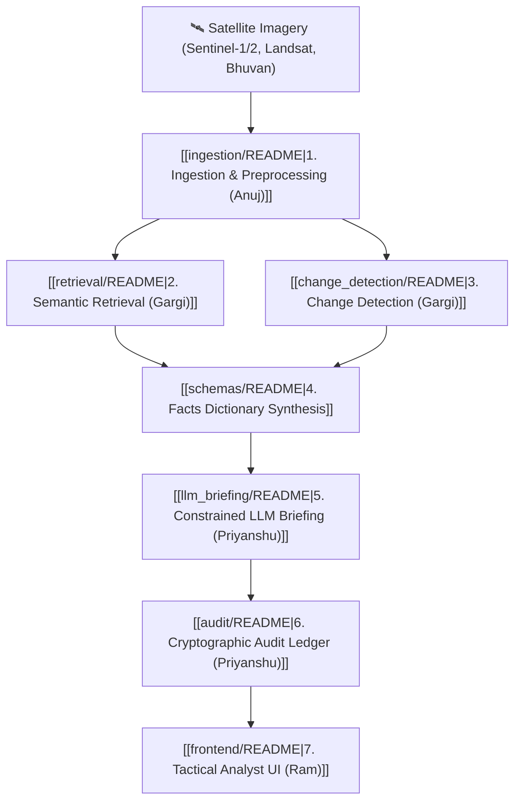

# SentinelEye System Architecture & Knowledge Graph

This document serves as the central Obsidian architecture index, connecting the modular pipelines of **SentinelEye** for military satellite intelligence.

---

## 🛰️ Pipeline Overview

---

## 👥 Module Ownership & Documentation

| Module | Lead | Documentation | Schemas & Artifacts |
|---|---|---|---|
| **System Overview** | Team Ulysses | [[README]] | [[CONTRIBUTING]], [[INTEGRATION]], [[DEMO_FALLBACK]] |
| **Ingestion** | Anuj | [[ingestion/README]] | `schemas/tile_metadata.json`, [[docs/DATA]] |
| **Semantic Retrieval** | Gargi | [[retrieval/README]] | `retrieval/indexes/`, [[models/MODEL_CATALOG]] |
| **Change Detection** | Gargi | [[change_detection/README]] | `schemas/change_record.json` (BIT & CVA fallback) |
| **LLM Briefing** | Priyanshu | [[llm_briefing/README]] | `llm_briefing/grammar/`, [[docs/LLM_SCHEMA]] |
| **Audit & Security** | Priyanshu | [[audit/README]] | `schemas/analyst_decision.json` (BLAKE3 + Ed25519) |
| **Geospatial Frontend** | Ram | [[frontend/README]] | Tactical Map & Swipe Slider |
| **Integration & QA** | Amritanshu | [[INTEGRATION]] | [[schemas/README]], [[DEMO_FALLBACK]] |

---

## 🔍 Key Documents for Hackathon / Jury Review
- [[README]] — Primary project overview, problem statement PS26227, core principles.
- [[INTEGRATION]] — Module API contracts, risk registry, verification status.
- [[DEMO_FALLBACK]] — Offline stage backup & replay procedures.
- [[docs/DATA]] — Satellite band mapping, resolutions, and precomputed datasets.
- [[docs/LLM_SCHEMA]] — Anti-hallucination GBNF grammar and structured facts dictionary.
- [[models/MODEL_CATALOG]] — Weights manifest (RemoteCLIP, BIT, Qwen/Gemma).
